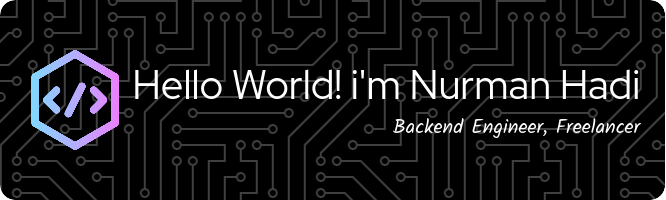

# 💫 About Me:
I'm a backend engineer who enjoys building reliable and scalable systems.   I love working with modern technologies and clean architecture principles to create efficient APIs and services.

## 🌐 Socials:
    

# 💻 Tech Stack:
                                  
# 📊 GitHub Stats:
 
 

## 🏆 GitHub Trophies

### ✍️ Random Dev Quote

### 🔝 Top Contributed Repo

<!-- Proudly created with GPRM ( https://gprm.itsvg.in ) -->

<picture>
  <source media="(prefers-color-scheme: dark)" srcset="https://raw.githubusercontent.com/nurmanhadi/nurmanhadi/output/pacman-contribution-graph-dark.svg">
  <source media="(prefers-color-scheme: light)" srcset="https://raw.githubusercontent.com/nurmanhadi/nurmanhadi/output/pacman-contribution-graph.svg">
  
</picture>

---